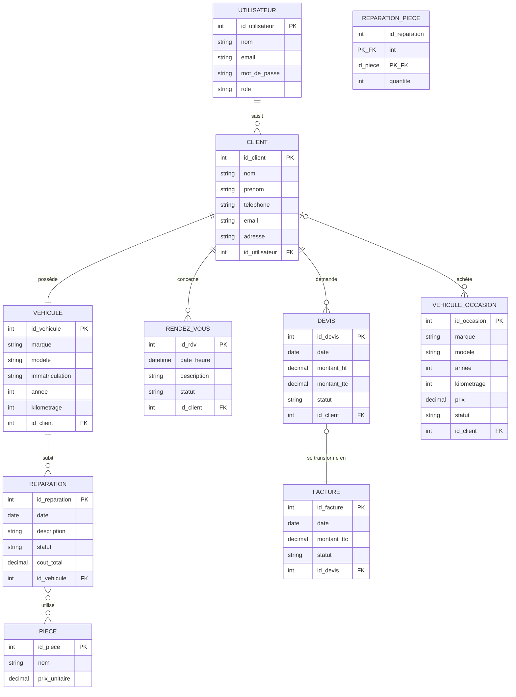

# MCD — AutoGest

Modèle de données de l'application AutoGest (gestion de garage).

> Note : Mermaid produit un diagramme entité-association (ERD), proche du MCD Merise.
> Les cardinalités sont notées au format "patte de corbeau" (crow's foot).
> Le tableau de correspondance avec les cardinalités Merise (0,n / 1,1...) est donné plus bas.

## Diagramme

## Correspondance des cardinalités (Merise)

| Association | Entité A | Cardinalité A | Cardinalité B | Entité B |
|---|---|---|---|---|
| saisit | UTILISATEUR | 1,n | 0,n | CLIENT |
| possède | CLIENT | 1,1 | 1,1 | VEHICULE |
| concerne | CLIENT | 1,1 | 1,n | RENDEZ_VOUS |
| subit | VEHICULE | 1,1 | 1,n | REPARATION |
| utilise (quantité) | REPARATION | 0,n | 0,n | PIECE |
| demande | CLIENT | 1,1 | 1,n | DEVIS |
| se transforme en | DEVIS | 1,1 | 0,1 | FACTURE |
| achète | CLIENT | 0,n | 0,1 | VEHICULE_OCCASION |

## Notes de conception

- **VEHICULE** (voitures des clients, qu'on répare) et **VEHICULE_OCCASION** (stock à vendre)
  sont deux entités distinctes : attributs et cycle de vie différents.
- L'association **utilise** (REPARATION ↔ PIECE) est de type plusieurs-à-plusieurs et porte
  un attribut (quantité). En MLD elle devient la table de liaison **REPARATION_PIECE**.
- Choix retenu : **1 client = 1 véhicule** (relation simplifiée).
- Choix retenu : **1 devis → 1 facture** (lien direct).
- Le champ `role` de UTILISATEUR distingue le patron de l'employé (gestion des droits).
