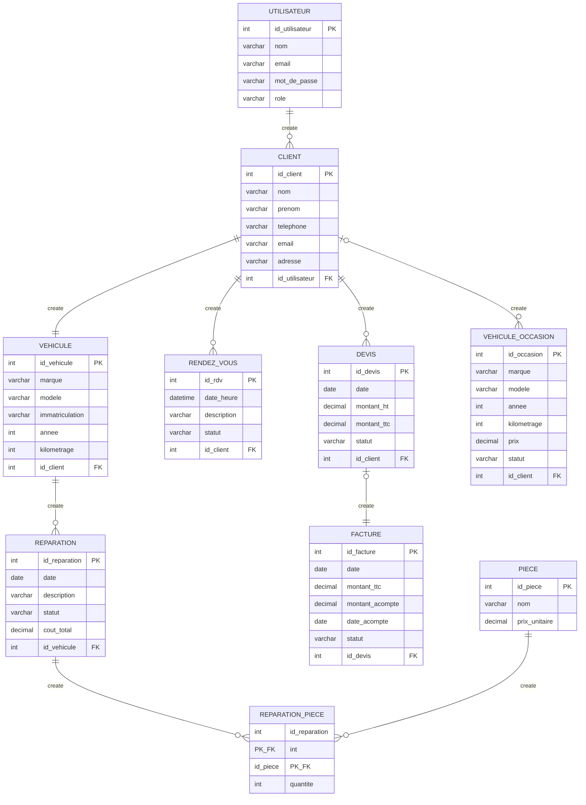

# MLD — AutoGest

Modèle Logique de Données de l'application AutoGest (gestion de garage).
Syntaxe : Markdown + Mermaid (`erDiagram`).

## Notes

- **PK** = clé primaire · **FK** = clé étrangère · **PK_FK** = clé primaire composée et étrangère.
- `REPARATION_PIECE` est la **table de liaison** issue de l'association n,n entre REPARATION et PIECE (elle porte l'attribut `quantite`).
- `FACTURE` contient `montant_acompte` et `date_acompte` (gestion de l'acompte).
- Choix de conception : 1 client = 1 véhicule · 1 devis → 1 facture.
- `id_client` dans VEHICULE_OCCASION est l'acheteur (nullable : un véhicule en stock n'a pas encore d'acheteur).
