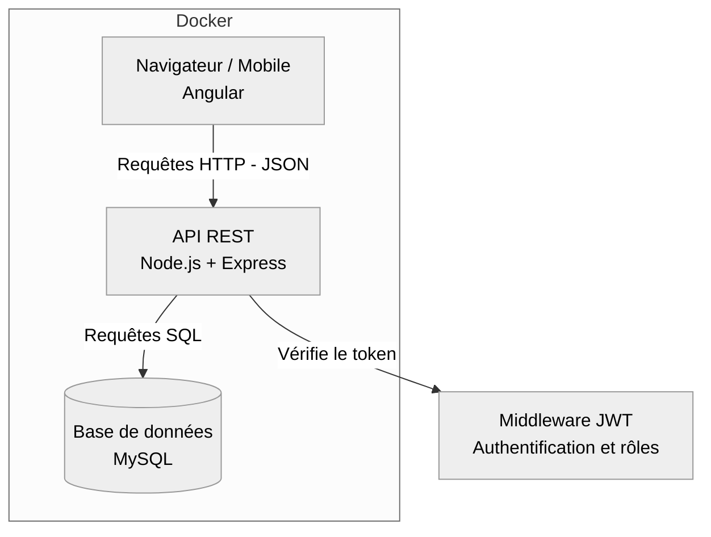

# Partie Non-Fonctionnelle — AutoGest

---

## 1. Stack technique

| Couche | Technologie | Rôle |
|---|---|---|
| Front-End | **Angular** | Interface utilisateur (mobile + desktop) |
| Back-End | **Node.js** + Express | API REST |
| Base de données | **MySQL** | Stockage des données (voir MPD) |
| Authentification | **JWT** + **bcrypt** | Connexion sécurisée, gestion des rôles |
| Conteneurisation | **Docker** + docker-compose | Déploiement (front, back, base de données) |
| Conception | Figma / Looping / Mermaid | Maquettes, MCD/MLD/MPD |

---

## 2. Architecture générale

**Explication simple :** le navigateur (Angular) envoie des requêtes à l'API (Node.js). L'API vérifie qui est connecté et son rôle (patron/employé), puis va chercher ou modifie les données dans MySQL. Les trois éléments tournent chacun dans leur propre conteneur Docker.

---

## 3. Exigences non-fonctionnelles

| Exigence | Détail |
|---|---|
| **Sécurité** | Mots de passe hashés (bcrypt), authentification par token JWT, contrôle des rôles sur chaque route sensible |
| **Responsive** | Interface utilisable sur mobile et desktop (garage à l'atelier + déplacements) |
| **Performance** | Réponses API rapides (recherche client en temps réel selon US 2.2) |
| **Disponibilité** | Application accessible pendant les horaires du garage |
| **Portabilité** | Déploiement simplifié grâce à Docker (même environnement partout) |

---

## 4. Endpoints de l'API (routes REST)

**Légende rôle :** 🟢 Patron + Employé · 🟠 Patron uniquement

### Authentification
| Méthode | Route | Description | Rôle |
|---|---|---|---|
| POST | `/api/auth/login` | Connexion | Public |
| POST | `/api/auth/logout` | Déconnexion | 🟢 |

### Utilisateurs (employés)
| Méthode | Route | Description | Rôle |
|---|---|---|---|
| POST | `/api/utilisateurs` | Créer un compte employé | 🟠 |
| GET | `/api/utilisateurs` | Liste des employés | 🟠 |

### Clients
| Méthode | Route | Description | Rôle |
|---|---|---|---|
| GET | `/api/clients?search=` | Liste / recherche (nom, tél, véhicule) | 🟢 |
| GET | `/api/clients/:id` | Détail d'un client | 🟢 |
| POST | `/api/clients` | Créer un client | 🟢 |
| PUT | `/api/clients/:id` | Modifier un client | 🟢 |
| DELETE | `/api/clients/:id` | Supprimer un client | 🟠 |

### Véhicules (clients)
| Méthode | Route | Description | Rôle |
|---|---|---|---|
| GET | `/api/vehicules?search=` | Recherche par véhicule | 🟢 |
| GET | `/api/vehicules/:id` | Détail véhicule + propriétaire | 🟢 |
| PUT | `/api/vehicules/:id` | Modifier un véhicule | 🟢 |

### Rendez-vous
| Méthode | Route | Description | Rôle |
|---|---|---|---|
| GET | `/api/rendez-vous?date=` | Planning (filtré par jour) | 🟢 |
| POST | `/api/rendez-vous` | Créer un RDV | 🟢 |
| PUT | `/api/rendez-vous/:id` | Modifier un RDV | 🟢 |
| DELETE | `/api/rendez-vous/:id` | Annuler un RDV | 🟢 |

### Réparations & pièces
| Méthode | Route | Description | Rôle |
|---|---|---|---|
| GET | `/api/reparations` | Liste des réparations | 🟢 |
| GET | `/api/reparations/:id` | Détail d'une réparation | 🟢 |
| POST | `/api/reparations` | Créer une réparation | 🟢 |
| PUT | `/api/reparations/:id` | Modifier / changer le statut | 🟢 |
| POST | `/api/reparations/:id/pieces` | Ajouter une pièce | 🟢 |
| GET | `/api/pieces` | Catalogue des pièces | 🟢 |

### Devis
| Méthode | Route | Description | Rôle |
|---|---|---|---|
| GET | `/api/devis` | Liste des devis | 🟠 |
| GET | `/api/devis/:id` | Détail / aperçu | 🟠 |
| POST | `/api/devis` | Créer un devis | 🟠 |
| GET | `/api/devis/:id/pdf` | Télécharger en PDF | 🟠 |
| POST | `/api/devis/:id/envoyer` | Envoyer par mail | 🟠 |
| POST | `/api/devis/:id/transformer` | Transformer en facture | 🟠 |

### Factures
| Méthode | Route | Description | Rôle |
|---|---|---|---|
| GET | `/api/factures?statut=&client=&date=` | Liste + filtres | 🟠 |
| GET | `/api/factures/:id` | Détail d'une facture | 🟠 |
| GET | `/api/factures/:id/pdf` | Télécharger en PDF | 🟠 |
| POST | `/api/factures/:id/envoyer` | Envoyer par mail | 🟠 |
| PUT | `/api/factures/:id/payee` | Marquer comme payée | 🟠 |

### Vente de véhicules d'occasion
| Méthode | Route | Description | Rôle |
|---|---|---|---|
| GET | `/api/vehicules-occasion` | Stock disponible | 🟠 |
| POST | `/api/vehicules-occasion` | Ajouter un véhicule à vendre | 🟠 |
| PUT | `/api/vehicules-occasion/:id/vendu` | Marquer comme vendu | 🟠 |

---

## Notes

- Toutes les routes (sauf `/api/auth/login`) nécessitent un **token JWT valide** dans l'en-tête `Authorization`.
- Le contrôle du rôle (🟠 patron uniquement) se fait via un **middleware** dédié côté API, cohérent avec le diagramme de cas d'utilisation (héritage Patron → Employé).
- Cette liste pourra être affinée pendant le développement (ajout de routes secondaires si besoin).
